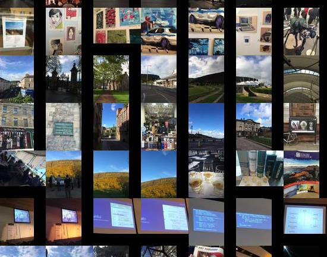

pixelizer
=========

bundles pictures from a directory for easy browsing

For example, if you have a bunch of pictures (from a camera or from screenshots) in a directory './photos', you can run:

    $ pixelize

And obtain a manifest of the pictures and a directory with thumbnails.

Opening the directory with a static web server such as [super static]() then gives:

# Install

This is a npm repo, use:

    $ npm install -g pixelizer

# License

MIT, (c) Patrick Mulder, 2014

